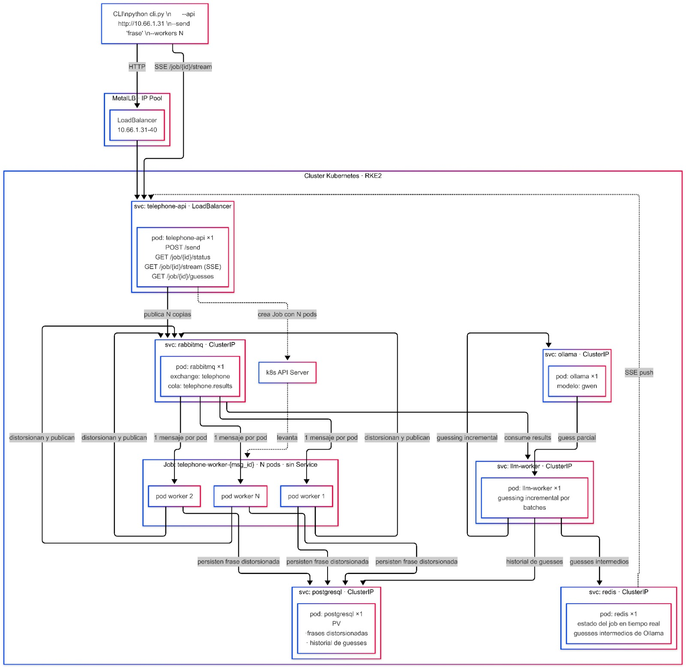

# PI-Palau-Massacesi-Cohen-Puentes
## Proyecto Integrador

### Diagrama

### Descripcion del proyecto
Este proyecto implementa un flujo distribuido de distorsion y reconstruccion de frases sobre un cluster Kubernetes RKE2. La exposicion externa se realiza mediante MetalLB (IP Pool) y un servicio LoadBalancer en el rango 10.66.1.31-40. El cliente CLI en [code/cli.py](code/cli.py) envia la frase y la cantidad de workers hacia la API principal, y luego consume resultados en tiempo real via SSE.

La API `telephone-api` (svc LoadBalancer, 1 pod) ofrece los endpoints `POST /send`, `GET /job/{id}/status`, `GET /job/{id}/stream` (SSE) y `GET /job/{id}/guesses`. Al recibir una solicitud, publica N copias en RabbitMQ (svc ClusterIP, exchange `telephone`, cola `telephone.results`) y crea un Job `telephone-worker-{msg_id}` con N pods a traves del k8s API Server.

Cada worker consume un unico mensaje, distorsiona la frase y publica el resultado en la cola correspondiente. Luego, el servicio `llm-worker` (svc ClusterIP, 1 pod) procesa los resultados en batches y realiza un guessing incremental consultando a Ollama (svc ClusterIP, 1 pod, modelo `gwen`). Los guesses parciales y el estado del job se guardan en Redis (tiempo real, SSE), mientras que PostgreSQL con PV persiste las frases distorsionadas y el historial de guesses.

### Componentes
- Cliente CLI: envia frase y cantidad de workers; consume SSE.
- MetalLB + LoadBalancer: exposicion externa del servicio.
- `telephone-api`: API principal con `POST /send`, `GET /job/{id}/status`, `GET /job/{id}/stream`, `GET /job/{id}/guesses`.
- RabbitMQ: exchange `telephone` y cola `telephone.results` para la distribucion de mensajes.
- Job `telephone-worker-{msg_id}`: N pods que distorsionan y publican resultados.
- `llm-worker`: consumo por batches y guessing incremental.
- Ollama (modelo `gwen`): motor de reconstruccion de la frase original.
- Redis: estado del job y guesses intermedios para SSE.
- PostgreSQL + PV: persistencia de frases distorsionadas e historial de guesses.

### Flujo paso a paso
1. El CLI envia la frase y la cantidad de workers a la API `telephone-api`.
2. La API expone el job y habilita consulta de estado, stream SSE y listado de guesses.
3. La API publica N copias en RabbitMQ y crea un Job con N pods workers.
4. Cada worker consume una copia, distorsiona la frase y publica el resultado.
5. `llm-worker` agrupa resultados en batches y consulta a Ollama (gwen).
6. Los guesses parciales se guardan en Redis y se emiten por SSE en tiempo real.
7. PostgreSQL persiste las frases distorsionadas y el historial completo.
